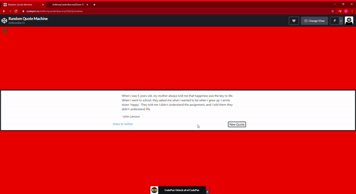

# Random-Quote-Generator

## What I created

An application that generates different random quotes whenever they click the button to do so. 

## What I learned

* How to use React components.
* How to change states based on the changes the user makes.
* How to implement an API to help display the random quotes.
